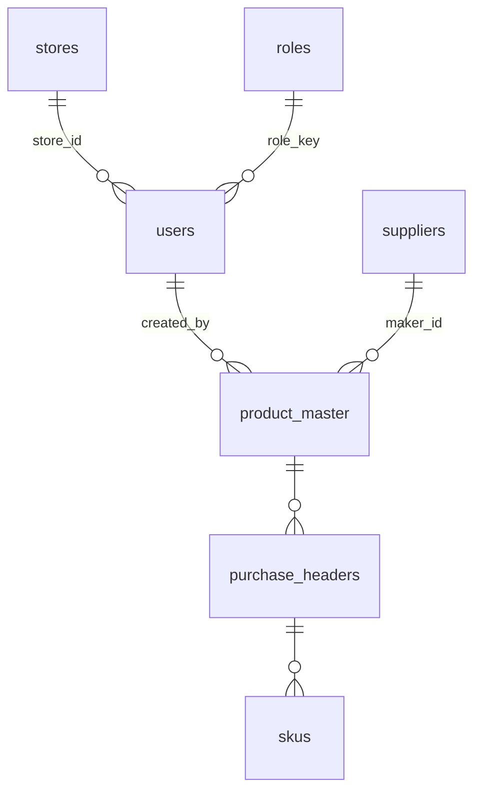

# Cosmos ERP — database structure overview

This document describes how the MSSQL schema is **organized**, **deployed**, and **extended**. It does not list every column; use SSMS or `INFORMATION_SCHEMA` for generated docs.

## Layers

| Layer | Location | Role |
|--------|-----------|------|
| Database shell | `sql/create_database.sql` | Creates `CosmosERP` (once per instance). |
| Base tables | `sql/tables/*.sql` | Idempotent `CREATE TABLE` scripts; **order is defined in `sql/manifest.json`**. |
| Historical alters | `sql/alter/NN_*.sql` | Early incremental DDL (numbered); keep order when replaying greenfield. |
| Release migrations | `sql/migrations/*.sql` | New changes ship here; often paired with Node scripts in `package.json`. |
| Programs | `sql/sp/*.sql` | Stored procedures — **only** DB API consumed by Node (`executeStoredProcedure`). |
| Seeds (deprecated) | `sql/seed/*.sql` | No-op stubs; configure data in Command Unit / Foundry. |

## Bounded contexts (mental model)

- **Shared core** — identity & access: `users`, `roles`, `role_permissions`, `stores`, `store_module_access`, audit/settings (`01_shared_core`, `02_command_unit`).
- **Foundry** — procurement → SKU: suppliers, purchases, pipeline stages, stock balances, digitisation (`03_foundry_core`, `04_foundry_stock_rate`).
- **Branding agents** — dispatch targets for branding stage (`04_branding_agents`).
- **Store OS / POS** — tablets, catalogue, carts, payments, loyalty (`05_*` … `11_*`).
- **Order engine** — commerce orders adjacent to POS (`12_order_engine`).
- **Finance / CX / Labs** — extended via `sql/alter/*` and `sql/migrations/*`.

## Naming conventions

- Tables: **`dbo.snake_case`** domain nouns (`purchase_headers`, `stock_balances`).
- Primary keys: **`{entity}_id`** `INT IDENTITY`.
- Business timestamps: IST wall-clock defaults via `DATEADD(MINUTE, 330, SYSUTCDATETIME())` (see workspace IST rules).
- RBAC: lowercase dotted permission keys in app catalogue; `role_key` / `store_code` are stable identifiers.

## Core references (simplified)

(Full FK graph spans many tables; use the live database when refactoring.)

## Cleaner greenfield path

1. Run `sql/create_database.sql`.
2. Run `node scripts/run-sql.js` — reads **`sql/manifest.json`** and executes **`sql/tables`** in that order (fails if an extra `.sql` file exists under `tables/` but is not listed).
3. Run `sql/alter/*.sql` in numeric filename order (legacy baseline).
4. Apply `sql/migrations/*.sql` per release / runbooks.
5. Deploy `sql/sp/*.sql` (procedure dependency order maintained in ops).
6. Do **not** auto-seed — configure roles, stores, lookups, and POS reference data in the app (`sql/seed/README.md`).

## Brownfield (existing database)

- Avoid re-running base table scripts except where they are strictly idempotent guards.
- Ship structural changes through **`sql/migrations/`** and redeploy affected procedures.
- **`45_users_rename_password_to_password_hash.sql`** — one-time rename/consolidate of staff credential column to **`password_hash`**; run **`npm run migrate:45-users-password-hash`**, then **`npm run deploy:auth-users-sp`** (or redeploy **`sql/sp/auth.sql`** and **`sql/sp/users.sql`** manually).
- **`47_store_type_catalog.sql`** — reference table **`dbo.store_type_catalog`** for **`stores.store_type`** keys (HQ, Owned, Franchise, Kiosk, Online); optional **`FK_stores_store_type_catalog`** when data is clean. App catalogue: **`src/config/storeTypesCatalog.js`**. Run **`npm run migrate:47-store-type-catalog`**.

## See also

- `sql/README.md` — SQL folder operator guide.
