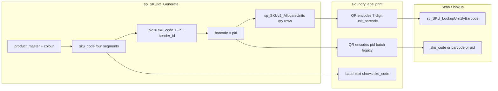

# QR, PID, and SKU structure (Cosmos Foundry)

How **`sku_code`**, **`pid`**, **`barcode`**, **`unit_barcode`**, and printed **QR codes** relate after digitisation. For generation rules and API entry points, see [sku-generation.md](./sku-generation.md).

## Conceptual model

Identifiers after digitisation:

| Field | Table | Role | Uniqueness |
|-------|--------|------|------------|
| **`sku_code`** | `dbo.skus` | Stable **product identity** (brand + collection + model + colour) | **Not** globally unique across purchases |
| **`pid`** | `dbo.skus` | **Purchase-scoped** batch (one SKU row per purchase line colour) | **Unique** (`UQ_skus_pid`) |
| **`barcode`** | `dbo.skus` | Batch scan key (legacy / batch guns) | **Unique**; **`barcode = pid`** at generation |
| **`unit_barcode`** | `dbo.sku_units` | **Per physical piece** (each “nos”) | **Globally unique** 7-digit numeric (`0000001`…`9999999`) |



Canonical generation write-up: [sku-generation.md](./sku-generation.md). SQL: [`sql/sp/pipeline_v2.sql`](../sql/sp/pipeline_v2.sql) (`sp_SKUv2_Generate`, `sp_SKUv2_AllocateUnits`).

---

## 1. `sku_code` format (four segments)

**Pattern:**

```
{Brand}-{Collection}-{Model}-{Colour}
```

**Example:** `EWS-BOTA-VR01-TRN` (illustrative)

| Segment | Max length (typical) | Source | SQL normalization |
|---------|----------------------|--------|-------------------|
| Brand | 3 chars | `home_brands.brand_name` (via `product_master.home_brand_id`) | `UPPER(LEFT(ISNULL(brand_name,'GEN'), 3))` |
| Collection | 4 chars | `product_master.ew_collection` | `UPPER(LEFT(REPLACE(ISNULL(ew_collection,'XX'),' ',''), 4))` |
| Model | up to 8 chars | `source_model_number`, else `style_model` | Strip spaces/hyphens; `UPPER(LEFT(..., 8))`; empty → **`UNK`** |
| Colour | 3 chars | `purchase_item_colours.colour_code` | `UPPER(LEFT(REPLACE(ISNULL(colour_code,'00'),' ',''), 3))` |

**Legacy (pre–4-segment):** older rows may have **three** body segments (e.g. `GEN-OLD-STD`) while `pid`/`barcode` still carry purchase scope (`GEN-OLD-STD-P38`). See [`sql/maintenance/fix_sku_GEN_OLD_STD_P38_four_segment.sql`](../sql/maintenance/fix_sku_GEN_OLD_STD_P38_four_segment.sql).

---

## 2. `pid` format (purchase event id)

**Pattern:**

```
{sku_code}-P{header_id}
```

**Optional collision suffix:** `-1`, `-2`, … if `{sku_code}-P{n}` already exists.

**Examples:**

- `EWS-BOTA-VR01-TRN-P42` → purchase header **#42**
- `GEN-OLD-E800-STD-P38` → purchase **#38**

**Meaning of `-P{n}`:** `n` is **`purchase_headers.header_id`**, not a global SKU sequence.

**Constraints:** `pid` is `NOT NULL`, unique (`UQ_skus_pid`). Added/migrated in [`sql/maintenance/add_pid_to_skus.sql`](../sql/maintenance/add_pid_to_skus.sql).

---

## 3. `barcode` format

**Current rule (generation):**

```
barcode = pid
```

Batch-level scans use the **full PID**, not the shorter `sku_code` alone.

**Legacy:** some rows may still have `barcode === sku_code` with no purchase suffix.

**Per-unit labels:** print **`unit_barcode`** (7 digits), not `pid`. `skus.barcode` stays **`pid`** for batch compatibility.

---

## 4. What the QR code contains

QR is **not** JSON or a URL — it is **plain text** (max **512** chars at [`src/api/qr.js`](../src/api/qr.js)).

### Encoding rule (label print)

`_bcQrPayload` in [`src/public/js/foundry-prototype.js`](../src/public/js/foundry-prototype.js):

```5820:5828:src/public/js/foundry-prototype.js
  function _bcQrPayload(sk) {
    const ub = sk.unit_barcode != null && String(sk.unit_barcode).trim() !== '' ? String(sk.unit_barcode).trim() : '';
    if (/^\d{7}$/.test(ub)) return ub;
    const sku = sk.sku_code || '';
    const p = sk.pid != null && String(sk.pid).trim() !== '' ? String(sk.pid) : '';
    const b = sk.barcode != null && String(sk.barcode).trim() !== '' ? String(sk.barcode) : '';
    if (p) return p;
    if (b && b !== sku) return b;
    return sku;
  }
```

Priority:

1. **`unit_barcode`** (7 digits) — per-unit label (one QR per row in `dbo.sku_units`)
2. Else **`pid`**
3. Else **`barcode`** if **≠ `sku_code`**
4. Else **`sku_code`**

The print modal expands each SKU into **one row per unit** via `GET /api/skus/:skuId/units` (or `units` on purchase SKU payloads).

### Human-readable text on the label

- **Below the QR:** **`sku_code`**
- Optional: piece number (`unit_no`) when printing per-unit rows
- **Not** the PID in the main text line (unless legacy row where values coincide)

### QR image generation

- Preview / browser print: `GET /api/qr?data={encodeURIComponent(payload)}&size={px}`
- USB TSC print: TSPL `QRCODE` with the same payload
- PNG: ECC **M**, quiet zone **1** ([`src/api/qr.js`](../src/api/qr.js))

---

## 5. Database shape

### `dbo.skus` (batch row)

- `sku_id`, `sku_code`, `pid`, `barcode`
- `header_id`, `item_id`, `item_colour_id`, `product_master_id`
- `quantity`, prices, `status`, media URLs

Base: [`sql/tables/04_foundry_stock_rate.sql`](../sql/tables/04_foundry_stock_rate.sql); `pid` from [`sql/maintenance/add_pid_to_skus.sql`](../sql/maintenance/add_pid_to_skus.sql).

### `dbo.sku_units` (each physical piece)

Migration: [`sql/migrations/50_sku_units_and_pos_unit_barcode.sql`](../sql/migrations/50_sku_units_and_pos_unit_barcode.sql).

| Column | Meaning |
|--------|---------|
| `unit_id` | Surrogate PK |
| `sku_id` | FK → `dbo.skus` |
| `unit_no` | 1…N within the batch |
| `unit_barcode` | `CHAR(7)` — QR payload for this piece |
| `status` | `AVAILABLE` \| `SOLD` \| `RESERVED` |

Linked at sale via **`dbo.order_item_units`**.

---

## 6. Example: purchase qty 5

**Purchase #38**, one colour line, **quantity = 5**:

| Layer | Value |
|-------|--------|
| `sku_code` | `EWS-BOTA-VR01-TRN` (same for all 5 pieces) |
| `pid` / `skus.barcode` | `EWS-BOTA-VR01-TRN-P38` (one `dbo.skus` row) |
| `sku_units` | 5 rows, e.g. `001042` … `001046` |

- **Print 5 labels** → five **different** 7-digit QRs.
- **Scan `001044`** → `sku_id` + `unit_no = 3`.
- **Scan `EWS-BOTA-VR01-TRN-P38`** → batch lookup (still supported).

---

## 7. How scans resolve the payload

| Consumer | Endpoint / SP | Match logic |
|----------|----------------|-------------|
| Foundry PID detail | `GET /api/skus/lookup/:pid` | `WHERE s.pid = @pid` |
| Stock transfer | `GET /api/stock-transfers/lookup?q=` → `sp_StockTransfer_LookupByCode` | 7-digit → `sku_units`; else `sku_code` / `barcode` |
| POS unit scan | `GET /api/pos/unit-lookup?q=` → `sp_SKU_LookupUnitByBarcode` | `unit_barcode` → `unit_id`, `sku_id`, `status` |
| POS checkout | `POST /api/pos/orders` | Types with **`requires_unit_barcode`** need **`unit_id`**; unit → `SOLD`, `stock_balances` -= 1 |
| POS catalogue (legacy add) | Search by name / `pid` / `sku_code` | Cart line without unit until **7-digit scan** on cart (except **CONTACT_LENS**) |

**Implication:** **`sku_code` alone** can be ambiguous across purchases; **7-digit `unit_barcode`** or **`pid`** are the reliable scan keys.

---

## 8. Generation API entry point

- **`POST /api/purchases/:headerId/generate-sku`**
- Body: `{ item_id, item_colour_id, sale_price }`
- Calls **`dbo.sp_SKUv2_Generate`** when header is **`PENDING_DIGITISATION`**
- Permission: `foundry.digitisation.create`
- Response includes **`units: [{ unit_no, unit_barcode }, …]`** when allocation ran

Details: [sku-generation.md](./sku-generation.md).

---

## 9. Quick reference

| Concept | Example |
|---------|---------|
| `sku_code` | `EWS-BOTA-VR01-TRN` |
| `pid` / batch `barcode` | `EWS-BOTA-VR01-TRN-P42` |
| QR (per unit) | `001044` |
| QR (batch / legacy) | `EWS-BOTA-VR01-TRN-P42` |
| Label text | `EWS-BOTA-VR01-TRN` |
| Legacy QR-only-SKU | `GEN-OLD-STD` |
