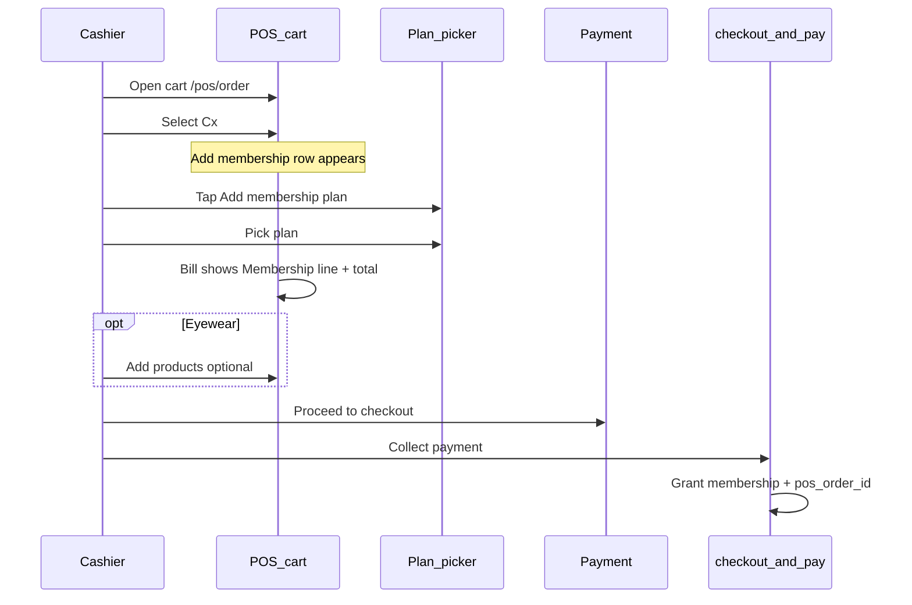

# POS cart — sell membership plan

## Purpose

Cashiers add an active membership plan (configured in Command Unit) to the Store OS cart, bill it on the same checkout, and activate the customer membership when payment succeeds. Membership is a **cart attachment** (`membership_sale`), not a catalogue SKU line.

---

## Prerequisites (admin / one-time)

| Requirement | Where |
|-------------|--------|
| Active membership plans | **Command Unit** → Membership Plans (`is_active = 1`) |
| Cashier permission | Role needs **`pos.membership.sell`** in `src/config/permissionsCatalogue.js`; assign in Command Unit → Roles, then **re-login** on POS |
| Database | Run `sql/migrations/76_pos_orders_membership_sale.sql` (and `75_customer_memberships_pos_order_link.sql` if not done) |
| API server | After deploy, **restart** `npm start` so `GET /api/pos/membership-plans` is registered (stale process → **404**) |

`super_admin` can sell without the permission key on the API; the POS UI also treats `super_admin` as allowed.

---

## Cashier flow (Store OS cart)

### Steps

1. **Open the cart** — Catalogue → add products (optional) → land on **`/pos/order`** (order builder).

2. **Select a customer (required)**  
   - Middle column: **Cx** → **Select Cx** (search or register).  
   - Without a customer, **Add membership plan** stays hidden and checkout is blocked.

3. **Add membership**  
   - Right column (**Bill Details**), under **Apply Coupon**: tap **Add membership plan**.  
   - Modal lists plans from `GET /api/pos/membership-plans`.  
   - Tap a plan (name + price). Toast: *Membership added to cart — activates on payment.*

4. **Review bill**  
   - **Subtotal** = product lines only.  
   - **Membership** row = plan name + fee (no GST on membership).  
   - **Total** = taxed product amount (after discount) **+ membership fee**.  
   - Example: ₹2,499 products + ₹499 plan → **Total ₹2,998** (when composition / zero GST).  
   - **Membership-only** (no eyewear) or **membership + frames/lenses** are both valid.

5. **Optional: coupon**  
   - **Apply Coupon** — member-only offers may appear while the plan is in cart (prospective eligibility via `prospective_plan_key`).

6. **Checkout**  
   - **Proceed to payment** → payment screen re-validates offers.  
   - Collect payment → membership **activates automatically** with `pos_order_id` on the grant row.  
   - Success toast when grant succeeds: *Payment recorded — membership is now active on this customer.*

7. **Change or remove**  
   - Tap **Add membership plan** again to change plan.  
   - **Clear Cx** removes membership from the cart.

---

## UI states

| State | Behaviour |
|-------|-----------|
| **Default** | **Add membership plan** visible when Cx selected and `pos.membership.sell` (or super_admin) |
| **Plan selected** | Membership bill row + subtext shows plan name · tap to change |
| **Membership-only cart** | No SKU lines required; `order_kind` can be `MEMBERSHIP` |
| **Mixed** | Eyewear lines + membership on one bill |

### Dual invoice (eyewear + membership)

When the cart has **both** product lines and a membership plan:

- **One Pay Now** — cashier still collects a single amount.
- Backend creates **one product order** + **`pos_membership_sales`** row (no EW-ORD for membership).
- **Two invoices**: product tax invoice (`EW-INV-{FY}-{store}-{seq}`) and **membership M-invoice** (`EW-INV-{FY}-{store}-M-{seq}`, no GST).
- **Advance (LAB/MIXED):** full membership fee is allocated **first**; remainder goes to product **`ADVANCE`**. Minimum tendered = membership fee + product advance minimum.
- `POST /api/pos/checkout-and-pay` response adds: `membership_sale_id`, `membership_invoice_no` (aliases: `membership_order_id` = sale id for transition).
- Membership grant links `customer_memberships.pos_membership_sale_id`.
- **Membership-only** cart: **no product order** — only M-invoice + membership sale.

**StorePilot Day Store Report:** product **Collection** excludes legacy `MEMBERSHIP` orders; **Membership collection** sums `pos_membership_payments` that day.

**Collection Book:** membership payments post to **`membership_store_cash`** / **`membership_payment_machine`** ledgers (separate from product ledgers).

### DOM / frames

| Screen area | Element |
|-------------|---------|
| Bill aside | `#btn-cart-add-membership` — **Add membership plan** |
| Bill summary | `#pos-ob-membership-row`, `#pos-ob-membership-lbl`, `#pos-ob-membership-val` |
| Modal | `#overlay-pos-cart-membership`, `#pos-cart-membership-list` |

**Pencil frames:** `/pos/order` (cart aside + membership row), `/pos/payment` (total + offer re-check).

**Shell:** `POS_Prototype.html`, styles in `src/public/css/lenskart-pos.css`, logic in `src/public/js/pos.js`.

---

## API (contract)

| Method | Path | Notes |
|--------|------|--------|
| GET | `/api/pos/membership-plans` | Active plans; requires `pos.membership.sell` |
| GET | `/api/pos/cart-offers?customer_id=&prospective_plan_key=` | Prospective member offers in cart |
| POST | `/api/pos/preview-order-discount` | Body may include `membership_sale` |
| POST | `/api/pos/checkout-and-pay` | `order.membership_sale: { plan_key, price_paid }`; returns `membership_id`, `membership_sale_id`, `membership_invoice_no` |
| GET | `/api/pos/membership-sales/:id` | M-invoice detail for preview/share |

Grant after payment: `src/services/membershipGrantService.js` (shared with CX comp grants).

---

## Troubleshooting

| Symptom | Likely cause | Fix |
|---------|----------------|-----|
| No **Add membership plan** row | No Cx selected | Select Cx first |
| Permission error on tap | JWT missing `pos.membership.sell` | Assign permission in CU → Roles; re-login |
| Modal: **404** on membership-plans | Old Node process | Kill port 4000, `npm start` |
| Modal: empty list | No active plans | Command Unit → Membership Plans |
| Checkout fails | Migration 76 not run | Run `76_pos_orders_membership_sale.sql` |
| Checkout fails (linked order) | Migration 87 not run | Run `npm run migrate:87-pos-linked-membership` |
| Coin balance **422** | Stale server before column fix | Restart server (uses `setting_key` / `setting_value`) |

---

## Retroactive split (legacy combined orders)

Orders checked out **before** M-invoice shipped may still have membership on the **product** `pos_orders` row.

**Split combined rows:** `npm run maintenance:split-legacy-membership-orders` (creates `pos_membership_sales` + M-invoice; requires migration **88**).

**Migrate old MEMBERSHIP orders:** `npm run maintenance:migrate-membership-orders-to-sales` (EW-ORD MEMBERSHIP rows → sales; marks orders `MIGRATED`).

Always **`--dry-run`** first.

---

## Out of scope (POS cart)

- **Free / comp membership** — use **CX** grant modal (no sale).
- **Membership as catalogue SKU** — not supported; no inventory / lab line.
- **Coin redemption at pay** — earn via CASHBACK offers only; redeem-at-pay is separate.

---

## Technical reference (developers)

- Cart state: `posCartMembershipSale` in `src/public/js/pos.js`; `localStorage` key `pos_cart` stores `{ lines, membership }`.
- Checkout: `buildMembershipSalePayload()` → `pendingCheckout.orderPayload.membership_sale`.
- Order totals: `src/services/orderService.js` — membership in subtotal/total; `sold_membership_*` on `pos_orders`.
- RBAC: `pos.membership.sell` in `src/config/permissionsCatalogue.js`; route gate in `src/api/pos.js`.
